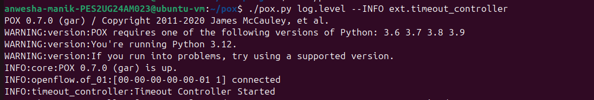
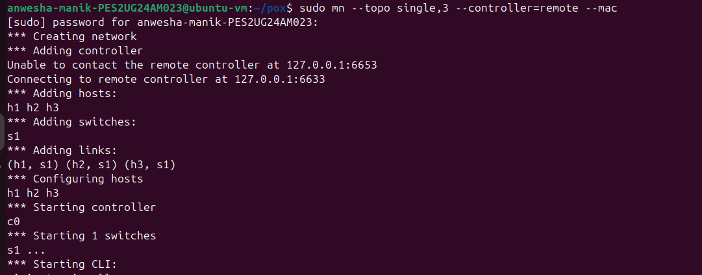
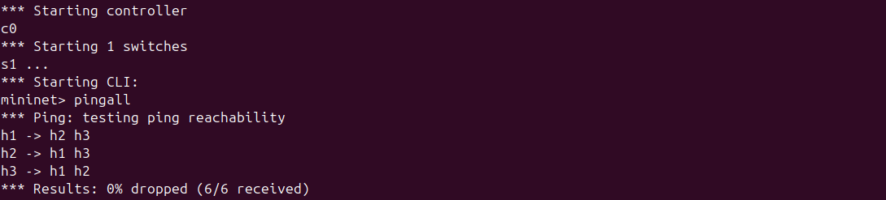
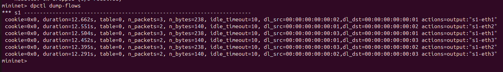

# SDN Flow Rule Timeout Manager using POX & Mininet

## Project Overview

This project demonstrates dynamic flow rule management in a Software Defined Networking (SDN) environment using the POX controller and Mininet. The controller installs flow rules based on traffic and removes them automatically using timeout mechanisms.

---

## Objectives

* Implement controller–switch interaction using OpenFlow
* Design match–action flow rules
* Apply timeout-based rule management
* Observe and analyze network behavior

---

## Key Features

* Learning switch functionality
* Dynamic flow rule installation
* Idle timeout-based flow removal
* Flow lifecycle tracking (FlowRemoved events)
* Automatic rule reinstallation after timeout

---

## Architecture

The system follows SDN architecture:

* **Control Plane:** POX Controller (decision making)
* **Data Plane:** OpenFlow switch (packet forwarding)
* Communication via OpenFlow protocol

---

## Topology

* 1 Switch (s1)
* 3 Hosts (h1, h2, h3)

Created using:

```bash
sudo mn --topo single,3 --controller=remote --mac
```

---

## Setup & Execution

### 1. Start Controller

```bash
cd ~/pox
./pox.py log.level --INFO ext.timeout_controller
```

### 2. Start Mininet

```bash
sudo mn --topo single,3 --controller=remote --mac
```

### 3. Test Connectivity

```bash
h1 ping -c 1 h2
h1 ping -c 1 h3
h2 ping -c 1 h3
```

---

## Working Principle

1. Switch sends **PacketIn** to controller
2. Controller learns MAC address mapping
3. Flow rule is installed (match + action)
4. Packet is forwarded immediately
5. Flow expires after idle timeout
6. New PacketIn triggers reinstallation

---

## Observations & Results

* Initial packets trigger controller interaction (higher latency)
* Subsequent packets are faster due to installed flow rules
* Flow entries are removed after timeout
* New rules are created when traffic resumes

---

## Validation & Regression Testing

* Repeated ping tests confirm consistent timeout behavior
* Flow rules expire and reinstall correctly each time

---

## Demo Outputs

* Controller logs showing flow installation
* Mininet ping results (0% packet loss)
* Flow table entries using:

```bash
dpctl dump-flows
```

---

## Code

Main implementation:

* `timeout_controller.py`

---

## 📷 Demo Screenshots

### 🔹 Controller Logs


### 🔹 Mininet Topology


### 🔹 Ping Results


### 🔹 Flow Table


## Conclusion

This project demonstrates efficient and dynamic flow rule management using SDN principles. Timeout-based rule handling improves flexibility and ensures optimal network performance.

---

## Repository

GitHub: https://github.com/ANWESHA-MANIK/CN-SDN-FLOW-TIMEOUT-MANAGER
